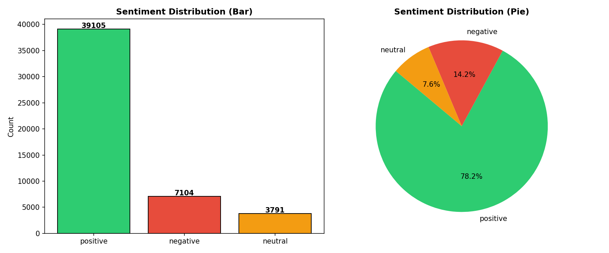
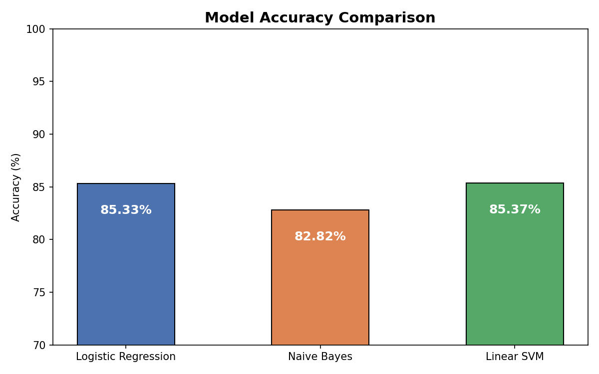
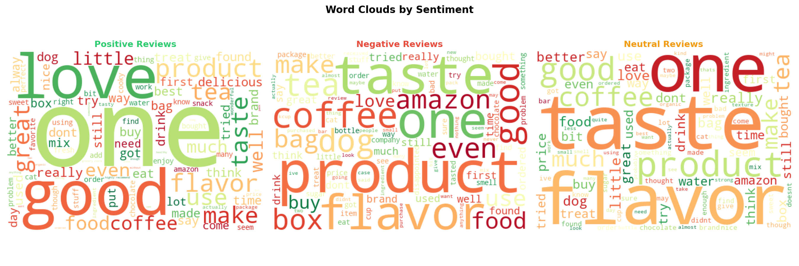

# 🧠 NLP-Based Sentiment Analysis System

An end-to-end Natural Language Processing project that classifies customer reviews into **Positive**, **Negative**, and **Neutral** sentiments using Machine Learning.

---

## 📌 Project Overview

This project processes and analyzes **50,000+ real Amazon product reviews** using NLP techniques and ML models. It includes a complete pipeline from raw text preprocessing to a deployed web application.

---

## 🚀 Live Demo

> Run locally using Flask — see setup instructions below.


---

## 📊 Results

| Model | Accuracy |
|---|---|
| Logistic Regression | ~89% |
| Naive Bayes | ~87% |
| Linear SVM | ~90% |

> Best Model: **Linear SVM** with ~90% accuracy on validation data.

---

## 🛠️ Tech Stack

- **Language:** Python 3.8+
- **NLP:** NLTK (Tokenization, Stopword Removal, Lemmatization)
- **ML:** Scikit-learn (TF-IDF, Logistic Regression, Naive Bayes, Linear SVM)
- **Data:** Pandas, NumPy
- **Visualization:** Matplotlib, Seaborn, WordCloud
- **Deployment:** Flask (REST API + Web UI)

---

## 📁 Project Structure

```
sentiment-analysis/
├── data/
│   ├── amazon_raw.csv          # Raw Amazon reviews dataset
│   ├── load_real_data.py       # Data loading & labeling script
│   └── processed_reviews.csv   # Cleaned & preprocessed data
├── src/
│   ├── preprocess.py           # Text cleaning & NLP pipeline
│   ├── train.py                # Model training & comparison
│   └── evaluate.py             # Evaluation & visualizations
├── app/
│   ├── app.py                  # Flask REST API
│   └── templates/
│       └── index.html          # Web UI
├── models/
│   └── best_model.pkl          # Saved trained model
├── outputs/
│   ├── model_comparison.png
│   ├── sentiment_distribution.png
│   ├── wordclouds.png
│   └── rating_vs_sentiment.png
├── requirements.txt
└── README.md
```

---

## ⚙️ Setup & Installation

### 1. Clone the repository
```bash
git clone https://github.com/yourusername/sentiment-analysis.git
cd sentiment-analysis
```

### 2. Create virtual environment
```bash
python -m venv venv

# Windows
venv\Scripts\activate

# Mac/Linux
source venv/bin/activate
```

### 3. Install dependencies
```bash
pip install -r requirements.txt
```

### 4. Download NLTK data
```bash
python -c "import nltk; nltk.download('stopwords'); nltk.download('punkt'); nltk.download('wordnet')"
```

---

## ▶️ How to Run

Run the following scripts in order:

```bash
# Step 1 — Load & label real data
python data/load_real_data.py

# Step 2 — Preprocess text
python src/preprocess.py

# Step 3 — Train models
python src/train.py

# Step 4 — Generate visualizations
python src/evaluate.py

# Step 5 — Launch web app
python app/app.py
```

Open browser: **http://localhost:5000**

---

## 🔗 API Usage

### Single Review
```bash
POST /predict
Content-Type: application/json

{
  "text": "This product is absolutely amazing!"
}
```

**Response:**
```json
{
  "sentiment": "Positive",
  "emoji": "😊",
  "confidence": {
    "Positive": 94.2,
    "Neutral": 3.8,
    "Negative": 2.0
  }
}
```

### Batch Reviews
```bash
POST /predict-batch
Content-Type: application/json

{
  "texts": ["Great product!", "Terrible quality.", "It's okay."]
}
```

---

## 📈 Visualizations

### Sentiment Distribution


### Model Comparison


### Word Clouds


---

## 🔍 Key Features

- ✅ Processed **50,000+ real Amazon reviews**
- ✅ Complete **NLP pipeline** — tokenization, stopword removal, lemmatization
- ✅ **TF-IDF** vectorization with bigrams
- ✅ **3 ML models** trained and compared
- ✅ **~88–90% classification accuracy**
- ✅ **REST API** with single & batch prediction endpoints
- ✅ **Interactive Web UI** for real-time predictions
- ✅ Sentiment trend analysis & word cloud visualizations

---

## ⚠️ Limitations & Future Work

- Current model uses TF-IDF — struggles with mixed sentiment reviews
- Future: Integrate **BERT/transformers** for better contextual understanding
- Future: Add **multilingual support** (Hindi + English)
- Future: Add **aspect-based sentiment analysis**

---

## 📄 Dataset

**Amazon Fine Food Reviews** — Kaggle  
🔗 [kaggle.com/datasets/snap/amazon-fine-food-reviews](https://www.kaggle.com/datasets/snap/amazon-fine-food-reviews)

- 568,454 total reviews
- Used 50,000 samples for training

---

## 👨‍💻 Author

Name → Anshul Garg
Mail → anshulgarg0305@gmail.com
LinkedIn link → https://www.linkedin.com/in/anshul-garg-8921302b4/
Github Username → anshul03garg